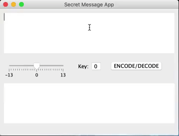
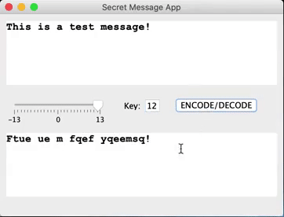

# SecretMessages
## Objective
App created with learning purposes related to GUI development for Java Desktop apps.

## App Description
This is a simple encryption application based on the Caesar Cipher device, developed in ancient Rome.
Letters and numbers change position based on their order. In the app this was reached by twisting the position of characters in the ASCII table.
The App features two large text fields, one for input of the message and one for the output of the encrypted/decrypted message. In between them there are a slide bar aside a small text field, both of them used to define the encryption parameter, and also an action button.

The app allows the decryption of the message the same way it is encrypted:

